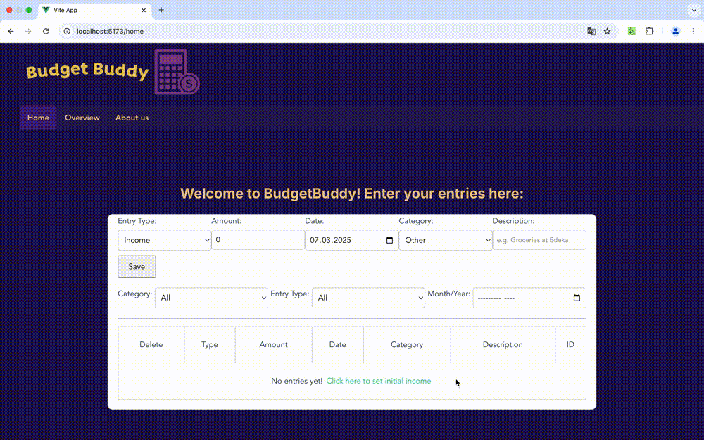
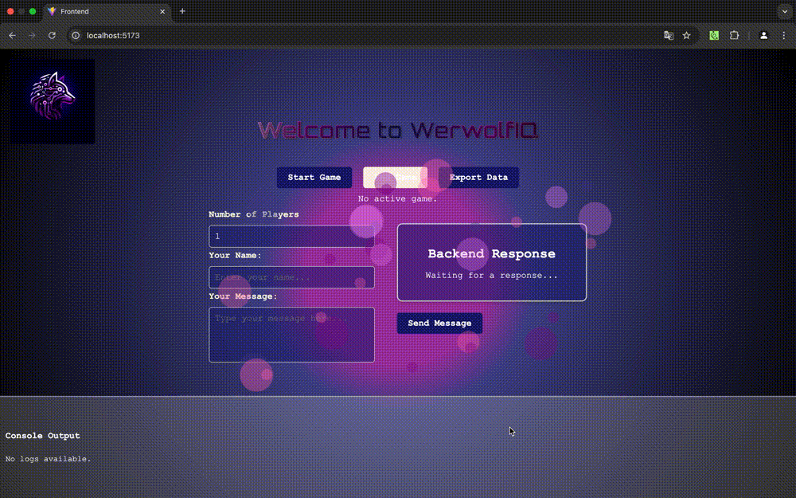

# WebTech-Projekt

Team Members: Seli, Laura

**Expense Planner App**

Overview
The Expense Planner App is a user-friendly web application designed to help individuals manage their 
personal finances with precision. It offers an intuitive interface for tracking and categorizing expenses, 
creating budgets, and visualizing financial activity over time.

**Use Cases**

1) Add a new Entry: Users can quickly log every income or expense, specifying its type, amount, date and add a description to it.

2) Categorize Entry: Each entry can be categorized, allowing users to also filter their expenses according to these categories.

3) Set Budgets: Users can set a monthly expense budget 

4) Set initial income: Users can set an initial income, if available 

5) Delete Entry: Users are able to delete an entry.

6) Summary (Total expenses per month/ Monthly budget): Users can see a summary of their expenses in comparison to their budget for every month.

7) View Entry-Log: Users can view all their entries in the entry table.

## Check out the example below – have fun!

# Unternehmensoftware-Projekt

Team Members: AJ, Seli, Laura

**WerwolfIQ App**

Overview
This is a frontend prototype for our WerwolfAI-powered application. 
The project is designed to interact with an AI model to play the game "Werwölfe von Düsterwald" with several agents
and one human player.

**Current Status:**
- The frontend is fully functional and designed using React, HTML/CSS, TypeScript
- The backend integration is still in progress, but the UI and core interactions are already implemented
- The app's interface is built for an intuitive user experience, ensuring accessibility and ease of use

